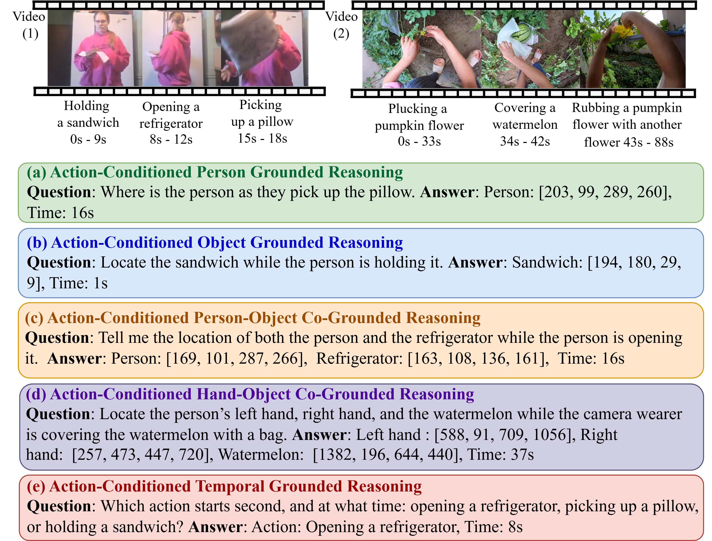

# Know-Show Benchmark

<div style="display: flex; justify-content: center;">
  
</div>

## Overview

**Know-Show** is a benchmark designed to evaluate **Video–Language Models (Video-LMs)** on **Spatio-Temporal Grounded Reasoning**.

## Source Datasets

The benchmark is constructed using the following datasets:

- **Charades**
- **Action Genome**
- **Ego4D**

You can download the source datasets from their official websites:

- Charades: https://allenai.org/plato/charades  
- Ego4D: https://ego4d-data.org

## Benchmark Version

- **Current version:** [Know-Show 1.0](Know-Show_1.1/)
<!-- - **Upcoming release:** **Know-Show 1.1 (coming soon)** -->


## Citation
If you use our Know-Show benchmark for your research, please cite our paper:
```bibtext
@article{sugandhika2025know,
  title={Know-Show: Benchmarking Video-Language Models on Spatio-Temporal Grounded Reasoning},
  author={Sugandhika, Chinthani and Li, Chen and Rajan, Deepu and Fernando, Basura},
  journal={arXiv preprint arXiv:2512.05513},
  year={2025}
}
```
