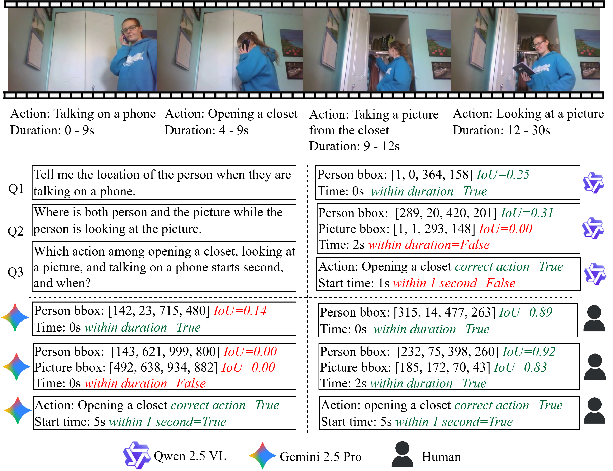

# Know-Show: Benchmarking Video-Language Models on Spatio-Temporal Grounded Reasoning

This repository contains the Know-Show benchmark and the official PyTorch implementation of the paper:

**Know-Show: Benchmarking Video-Language Models on Spatio-Temporal Grounded Reasoning (arXiv 2025)**  
Chinthani Sugandhika, Chen Li, Deepu Rajan, Basura Fernando


<!-- [](https://arxiv.org/abs/2410.22829) -->


## Abstract
Large Video-Language Models (Video-LMs) have achieved impressive progress in multimodal understanding, yet their reasoning remains weakly grounded in space and time. We present Know-Show, a new benchmark designed to evaluate spatio-temporal grounded reasoning, the ability of a model to reason about actions and their semantics while simultaneously grounding its inferences in visual and temporal evidence. Know-Show unifies reasoning and localization within a single evaluation framework consisting of five complementary scenarios across spatial (person, object, person–object, and hand–object) and temporal dimensions. Built from Charades, Action Genome, and Ego4D with 2.5K human-authored questions, the benchmark exposes significant gaps between current Video-LMs and human reasoning. To bridge this gap, we propose GRAM, a training-free plug-in that augments Video-LMs with fine-grained grounding through attention-based video token selection and explicit timestamp encoding. Extensive experiments across open and closed Video-LMs (Qwen, VideoLLaVA, GPT-4o and Gemini etc.) reveal that existing models struggle to “show what they know” and vice versa especially in fine-grained hand–object interactions. KnowShow establishes a unified standard for assessing grounded reasoning in video-language understanding and provides insights toward developing interpretable and reliable multimodal reasoning systems.

## Challenges of current Video-Language Models in Spatio-Temporal Grounded Reasoning.
 <!-- for Human Motion Q&A -->
<!--  -->
<div style="display: flex; justify-content: center;">
  
</div>

We split our repository into two sections:
1. Know-Show Benchmark
2. GRAM


## 1. Know-Show Benchmark
Please refer to [`Know-Show/`](Know-Show/)


## 2. GRAM
Please refer to [`GRAM/`](GRAM/)


## Citation
If you use our Know-Show benchmark or GRAM plug-in for your research, please cite our paper:
```bibtext
@article{sugandhika2025know,
  title={Know-Show: Benchmarking Video-Language Models on Spatio-Temporal Grounded Reasoning},
  author={Sugandhika, Chinthani and Li, Chen and Rajan, Deepu and Fernando, Basura},
  journal={arXiv preprint arXiv:2512.05513},
  year={2025}
}
```

## Acknowledgments

This research/project is supported by the National Research Foundation, Singapore, under its NRF Fellowship (Award\ NRF-NRFF14-2022-0001) and by funding allocation to Basura Fernando by the A*STAR under its SERC Central Research Fund (CRF), as well as its Centre for Frontier AI Research.
